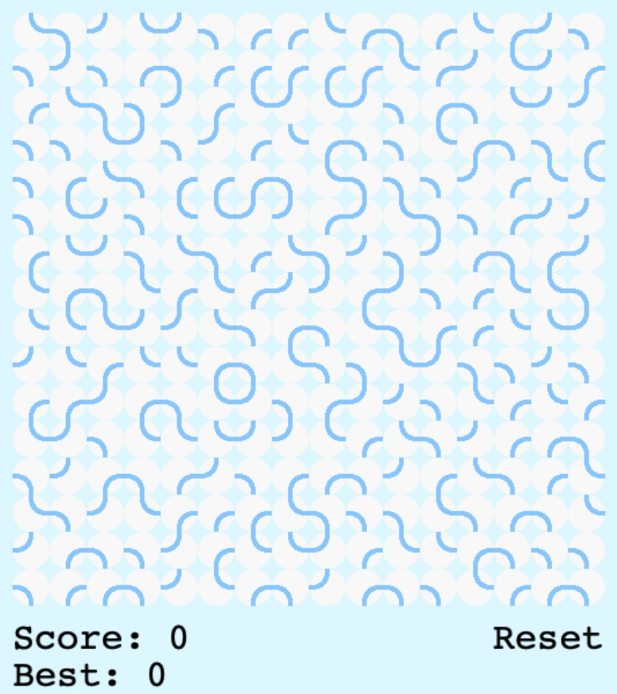

# Grid Game

This is a copy of a lovely little flash 'game' I discovered years ago but can't seem to find now, so I've re-created it from what I could find online.

The game is a simple grid of circles, each of which can be clicked to rotate it. Each circle will trigger its neighbours to rotate if the lines match up.

See what your high score can be!

